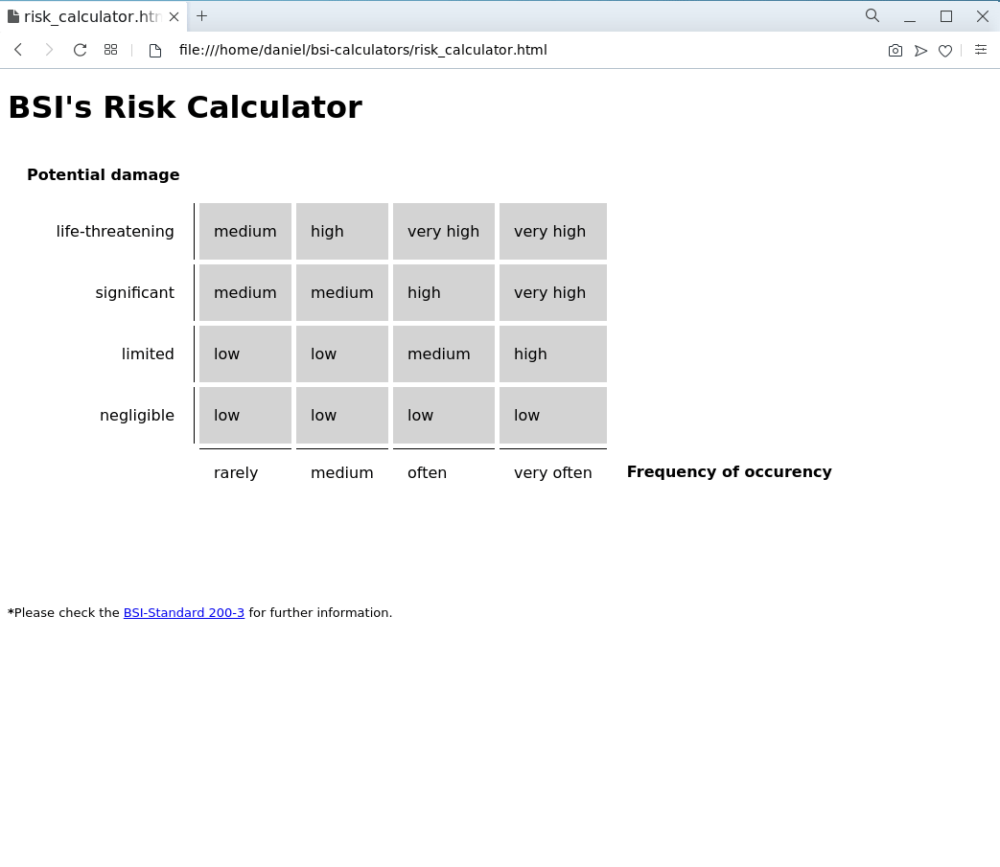
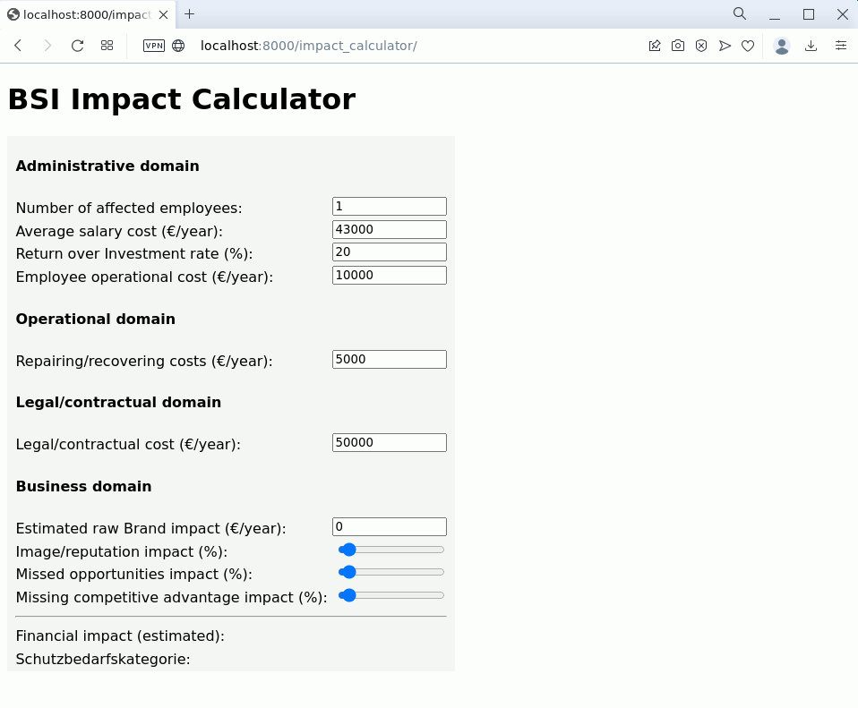

# bsi-calculators
Ready-to-run HTML/Javascript code to support BSI IT-Grundschutz risk and impact calculation.

* Disclaimer:
1. The code are PROTOTYPES only. They are completely functional but are here to present illustrations about how these concepts could be incorporated into daily activities.
2. This project is **completely independent of**  the Bundesamt für Sicherheit in der Informationstechnik - BSI. 

* Call for improvements:
The code here could be improved to reach better maintainence standards.
Some refinements suggestion are:

1. generate the entire HTML code (or most of it) via Javascript to facilitate incorporation in other projects.
2. improve the layout (CSS) for better visualization.

### Screenshots

## Risk calculator:

  

  
## Impact calculator:

The Impact calculator helps to estimate the cost of an incident when a precise methodology is not available.
The idea is to compute the **Opportunity Cost** (or the cost of "doing something else"), by estimating the amount of money a company spends when not doing what it is intended to be done due an incident. 
  
In an incident, resources are mobilized to work on activities that are not part of the primary activities of the company and this is what is called here "doing something else". By observing how much resource is spending while doing something else, companies can easily estimate the minimal cost of an incident affecting their business processes. 

  
  

  

* Technical references:

Please visit [BSI IT-Grundschutz](https://www.bsi.bund.de/EN/Themen/Unternehmen-und-Organisationen/Standards-und-Zertifizierung/IT-Grundschutz/it-grundschutz_node.html) for an overview of the concepts illustrated here.
